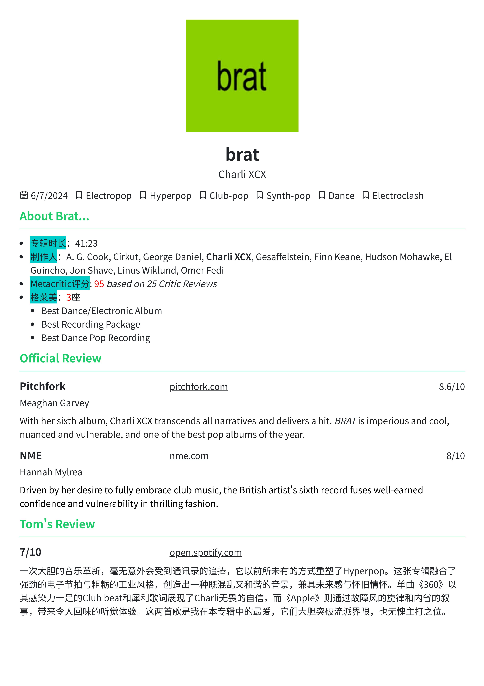
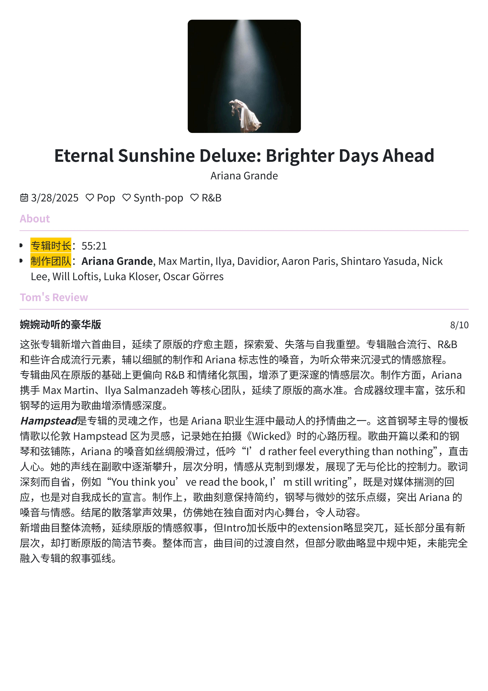

# 🎵 金汤历 (Tom's reZume)

> 一个创新的音乐记事本编辑器，让音乐记录变得简约而美好

## ✨ 项目简介

金汤历是一款音乐记事本编辑器，采用简历式的简洁设计风格，专为音乐爱好者打造。无需注册登录，数据完全本地存储，隐私安全有保障。

### 🎯 核心特性

- **📝 简历式设计** - 采用简洁的简历布局风格，让音乐记录井然有序
- **🎵 音乐专用** - 专为音乐评价、专辑记录、个人音乐笔记设计
- **🔒 隐私优先** - 所有数据本地存储，无需担心隐私泄露
- **🌙 主题切换** - 支持明暗主题切换
- **📤 数据导出** - 支持 PDF 和 JSON 格式导出备份

## 🚀 技术栈

- **前端框架**: Next.js 14 + React 18
- **类型系统**: TypeScript
- **样式方案**: TailwindCSS + Sass
- **UI 组件**: Radix UI + 自定义组件
- **状态管理**: Zustand
- **编辑器**: TipTap (富文本编辑)
- **动画效果**: Framer Motion
- **文件处理**: File System Access API
- **国际化**: next-intl (支持中英文)

## 📂 项目结构

```
src/
├── app/                    # Next.js App Router
│   ├── (public)/          # 公开页面
│   └── providers.tsx      # 全局 Provider
├── components/            # React 组件
│   ├── editor/           # 编辑器组件
│   ├── preview/          # 预览组件
│   ├── home/             # 首页组件
│   └── shared/           # 共享组件
├── store/                # Zustand 状态管理
├── types/                # TypeScript 类型定义
├── i18n/                 # 国际化配置
├── utils/                # 工具函数
└── config/               # 配置文件
```

## 🎨 主要功能模块

### 🎼 音乐记事本编辑

- **基本信息**: 个人资料、头像设置
- **专辑信息**: 关于专辑的详细介绍
- **官媒评价**: 官方媒体评价记录
- **个人评价**: 个人音乐感受和评价
- **自定义模块**: 可添加自定义内容模块

## 📸 应用截图

### 音乐评价展示

<div align="center">
  
  
</div>

> 展示音乐专辑评价的记录效果

### 📝 编辑功能

- **富文本编辑器**: 支持格式化文本、列表、对齐等
- **拖拽排序**: 支持模块拖拽重新排序
- **实时预览**: 所见即所得的编辑体验

### 💾 数据管理

- **本地存储**: 使用 File System Access API 本地文件存储
- **自动保存**: 编辑内容实时自动保存
- **数据导出**: 支持 PDF 和 JSON 格式导出
- **数据备份**: 完整的数据备份和恢复功能

## 🔧 开发环境搭建

### 环境要求

- Node.js 18+
- pnpm 9+ (推荐)

### 安装依赖

```bash
# 克隆项目
git clone [repository-url]
cd toms-rezume

# 安装依赖
pnpm install

# 启动开发服务器
pnpm dev
```

### 可用脚本

```bash
pnpm dev      # 启动开发服务器
pnpm build    # 构建生产版本
pnpm start    # 启动生产服务器
pnpm lint     # 代码检查
```

## 🌍 国际化支持

项目支持中英文双语：

- 中文 (`zh`): 金汤历
- English (`en`): Tom's reZume

## 📱 浏览器兼容性

- Chrome 86+ (推荐)
- Firefox 82+
- Safari 14+
- Edge 86+

> 注意：项目使用 File System Access API，需要现代浏览器支持

## 🎨 设计理念

### 简约至上

采用简历式的简洁设计，让用户专注于内容创作而不被复杂的界面分散注意力。

### 隐私保护

所有数据完全本地存储，不依赖云服务，确保用户音乐记录的绝对隐私。

### 用户体验

- 直观的拖拽操作
- 流畅的动画效果
- 响应式设计适配各种设备

## 🔒 隐私与安全

- ✅ 无需注册登录
- ✅ 数据完全本地存储
- ✅ 不收集任何用户信息
- ✅ 支持数据导出备份
- ✅ 开源透明

---

<div align="center">
  <strong>🎵 让音乐记录变得简约而美好 🎵</strong>
</div>
